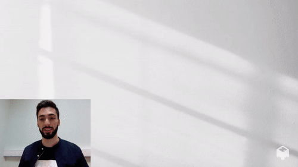
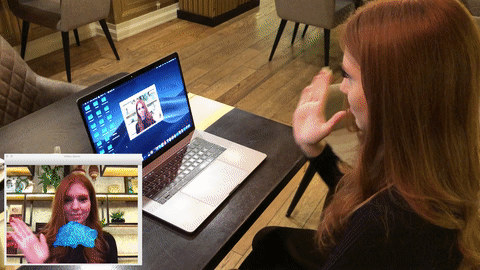

<div align="center">


# Jesture AI SDK

<!-- [](https://github.com/jesture-ai/jesture-sdk) -->

**Real-time gesture control made accessible.**

[](https://www.youtube.com/watch?v=sxaZ_yLgtLk&list=PL4Z9jysfxyfj9F1Kfdy_4oXKX9-MESCpP&index=1)
[](https://twitter.com/jestureai)
[](https://www.jesture.ai)
[](https://www.instagram.com/jesture.ai)
  
</div>

---

## Use-cases with Jesture AI SDK
Immersive Gaming | Web Apps                                                                                          
:----------------------------------------------------------------------------------------------------------------------------: | :-------------------------------------------------------------------------------------------------------------: 
| 

Slides Control | Visual Effects                                                                                                         
:-------------------------------------------------------------------------------------------------------------------------------------: | :----------------------------------------------------------------------------------------------------------------------------------:
| 

Music Control | Snap Masks                                                                                                                     
:-------------------------------------------------------------------------------------------------------------------------------------: | :----------------------------------------------------------------------------------------------------------------------------------:
| 

## Install

### MacOS

1. Clone this repo: `git clone https://github.com/jesture-ai/jesture-sdk`
2. Download the latest version of SDK from the [Releases](https://github.com/jesture-ai/jesture-sdk/releases) page
3. Place the downloaded archive into the `jesture_sdk/` folder and unzip it there:
```
jesture_sdk/
|-- install.sh
|-- remove.sh
|-- full_cpu.dylib
|-- third_party/
|-- mediapipe/
|-- third_party/
```
5. Install the dependencies: `sudo bash install.sh`
6. You are all set! Checkout the [Python demo](https://github.com/jesture-ai/jesture-sdk/tree/main/python) to learn how to run the SDK in Python.

If one wish to remove all the dependencies: `sudo bash remove.sh`.

**Note:** The script `install.sh` just copies the dependencies to `/usr/local/Cellar/jestureai/` and `/usr/local/opt/jestureai/` paths. To access them it requires priviledged access (`sudo`).

### Windows

SDK is not yet available on Windows. Stay tuned!

### Attribution 

See the `LICENSE` for more details on 3rd party software. 

<div>Icons made by <a href="https://www.freepik.com" title="Freepik">Freepik</a> from <a href="https://www.flaticon.com/" title="Flaticon">www.flaticon.com</a></div>
